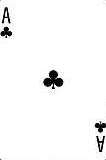
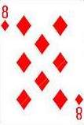
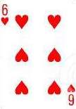
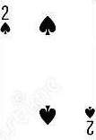
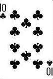
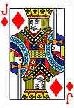

# Card Trick Using React

This project presents a simple card trick using the [React](https://github.com/facebook/create-react-app) library. 
I created this project as a fun way to learn React. Feel free to clone this project to learn how the React library can 
be used to easily create single page applications.

## How to Play

1) The application will deal 21 randomly selected cards from a 52 card deck. The cards are dealt from left-to-right in 7 rows and 3 columns.

<div style="background: #eeeeee;">
    <table cellpadding="4" cellspacing="1" width="100%" border="0">
    <thead>
    <tr>
        <th width="5">&nbsp;</th>
        <th align="left" valign="top">Column 1</th>
        <th align="left" valign="top">Column 2</th>
        <th align="left" valign="top">Column 3</th>
    </tr>
    </thead>
    <tbody>
    <tr>
        <td>1</td>
        <td>
            
        </td>
        <td>
            
        </td>
        <td>
            
        </td>
    </tr>
    <tr>
        <td>&nbsp;</td>
        <td align="center" valign="top" colspan="3">... ... ... ... ... ... 5 more rows ... ... ... ...  ...  ...  ...</td> 
    </tr>
    <tr>
        <td>7</td>
        <td>
            
        </td>
        <td>
            
        </td>
        <td>
            
        </td>
    </tr>
    </tbody>
    </table>
</div>

2) The player is asked to choose a card but not say the card out loud. Instead, say the column the card is in.
3) The application re-deals the 21 cards from left-to-right again and the player is asked again which column the card is in.
4) The application re-deals the 21 cards from left-to-right a final time and, again, the player is asked to choose which column the card is in.
5) After the third re-deal, the application identifies and displays the players card on the screen.

You can see the card trick in action from my website at [Estep Software Forensics](https://estepsoftwareforensics.com/card-trick)

## How does it Work?

It's magic! Ok, it's not magic. It's a process of elimination.

The elimination happens based on how you scoop and re-deal the cards. 
1) You scoop the cards column-by-colum, from top to bottom. 
   1) It's important that you keep the top card on the top of the pile on each column. For example, when scooping 
   Column 1 from the image above, the ace of clubs should remain on the top of the scooped column.
2) Most importantly, the column the user chooses must be scooped in the middle of the three columns. 
   1) For example, if the user chose the Jack of diamonds from the image above, you can scoop either column one or two first. You must scoop the third column next, and then the final column last.
3) You then turn the deck over and re-deal the cards again from left-to-right (top to bottom).
4) Repeat steps 1 - 3 three times. 
5) As you scoop and re-deal, the players card is being positioned in the dealt cards. On the third deal, the players card will always be the fourth card from the top. 
6) You now know the players card. You can then shuffle the cards, or perform any amount of theater to confuse and entertain the audience. Turn over the players chosen card and watch their amazement. :-)

## The Application

This application implements this scoop, re-deal, and card positioning logic. Ideally, the scoop, re-deal, and 
card positioning logic would be placed in a separate project which exposes REST services. But, for simplicity, I put the
model logic in the typescript. 

The CardLayout.tsx component encapsulates the trick. The model logic is in the `cardTrickModel` object.

```typescript
/**
 * An object which holds the model logic that knows how to deal, re-deal, and pick the correct card.
 * This logic would most-likely be in a separate REST layer project and this script would be replaced with simple REST
 * service calls.
 */
const cardTrickModel = {
        /**
         * Returns the card chosen by the player.
         * @param columnNumber the column number where the card lives.
         */
        pickCard(columnNumber: number): Card {
        },

        /**
         * Returns 52 deck of cards as an array of Cards.
         * @return the 52 cards.
         */
        openNewDeck(): Array<Card> {
        },

        /**
         * Returns 21 randomly chosen cards from a 52 card deck.
         * @return the 21 cards.
         */
        deal21(deck: Array<Card>): void {
        },

        /**
         * Re-arranges the 21 cards, keeping the order of the cards from top to bottom and keeping the selected column in
         * the middle of the three columns.
         * @param columnNumber the column number where the chosen card lives.
         */
        reDeal21(columnNumber: number): void {
        },
}
```

The exported component is called, `CardLayout`. It handles orchestrating the trick and displaying the cards.

I didn't go out of my way to make it too snazzy. It's a quick and simple application and a fun way of learning React.

Enjoy!

Doug
